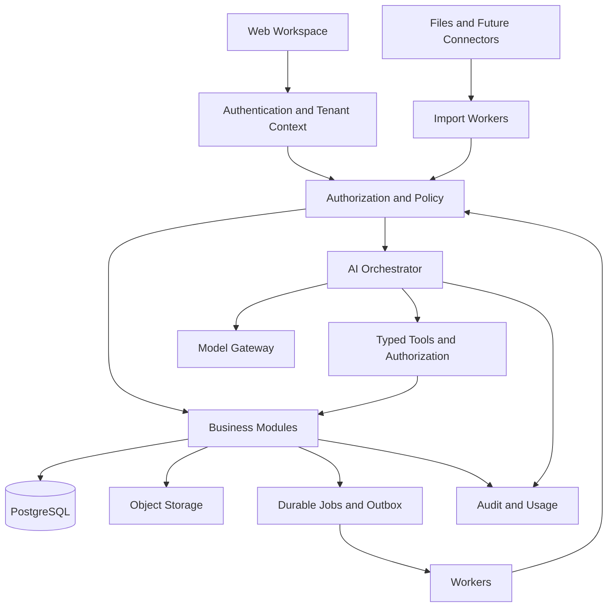

# Architecture baseline และ decisions

## ADR-001 — Modular monolith + workers

สถานะ: ใช้เป็นแนวทางของ local foundation; ความสามารถเป้าหมายในเอกสารนี้ไม่ได้หมายความว่าพัฒนาแล้วทั้งหมด ดู implementation boundary ใน [runbook](10-foundation-runbook.md)

แอปหลักแยกโมดูล Identity/Tenancy, Catalog/Cost, Imports, Settlement, Metrics, AI/Workflow, Audit/Usage และมี workers สำหรับงานยาว สื่อสารผ่าน contracts ชัดเจนก่อนแยก deployment เพิ่มตามหลักฐานจากโหลดหรือข้อกำหนดลูกค้า

ติดตั้ง TypeScript, Next.js, PostgreSQL/Drizzle, pg-boss และ AI SDK สำหรับ local foundation แล้วตาม [stack recommendation](08-stack-recommendation.md) ใช้ npm workspaces และ CSS ในแอปนี้ ยังไม่ได้ซื้อบริการหรือเลือก production model ข้อจำกัดงบและข้อมูลยังต้องยืนยัน

## ADR-002 — Tenant เป็น security boundary

- Tenant มีหลาย legal entities และ shops ได้ ขอบเขต grant ละเอียดกว่าระดับ tenant
- User เป็น identity กลางและมี memberships หลาย tenant ได้ ไม่มีการรวมสิทธิ์ข้าม tenant โดยอัตโนมัติ
- Tenant context มาจาก session ที่ตรวจ membership ไม่เชื่อ header/body/prompt อย่างเดียว
- Agency ใช้ delegated membership/grants ต่อ tenant ลูกค้า
- Tenant routing record เผื่อ home_region, isolation_mode และ resource location โดย client แก้ routing ไม่ได้
- เริ่ม pooled storage และเตรียมทางแยกทรัพยากร การย้าย tenant และ restore ราย tenant ต้องทดสอบก่อนเสนอเป็นบริการ

Data isolation: tenant-aware keys/foreign keys, RLS, server-side grants และ scoped object access ประกอบกัน Application DB role ต้องไม่เป็น owner/superuser/BYPASSRLS ตั้ง context ภายใน transaction และทดสอบ connection reuse ว่าไม่ค้าง tenant เดิม

Async jobs ผูก tenant, actor/service principal, authorization scope และ correlation ID ตรวจสิทธิ์ล่าสุดก่อนเข้าถึงข้อมูลหรือทำงานที่มีผล ไม่ฝากความปลอดภัยไว้กับ ID ในข้อความคิวเพียงอย่างเดียว

## ADR-003 — Financial source of truth ใช้โค้ดคำนวณ

โมเดลหลัก: Tenant, Membership, LegalEntity, Shop, Product, ProductVariant, AttributeDefinition, VariantAttributeValue, CategoryMapping, ChannelSkuMapping, CostVersion, ImportBatch, SourceRecord, Order, OrderLine, FinancialEvent, SettlementStatement, Payout, AdSpend, AllocationRuleVersion, MetricSnapshot, ReviewTask

Catalog กลางไม่ผูกกับเสื้อผ้า ProductVariant เป็นหน่วยขาย/SKU ที่อ้างต้นทุน สินค้าไม่มีตัวเลือกมี default variant สี ไซซ์ กลิ่น ความจุ และวัสดุเป็น attributes ที่ตรวจชนิด/หน่วยได้ แยกค่าที่ใช้คำนวณเงินและสิทธิ์ออกจาก flexible metadata ดู [product model](09-product-model.md)

- การ reconcile statement/payout กับออเดอร์แยกจากการคำนวณกำไร
- Financial events ใช้บันทึกเพิ่ม/ปรับปรุงที่มีประวัติ ไม่อ้างว่าเป็นบัญชีแยกประเภทตามกฎหมาย
- Raw source มี lineage, checksum, adapter version และ import time; เก็บตาม retention policy
- มี event/effective date, source update time, currency, timezone และ sign convention
- เก็บ amount เป็น decimal ที่กำหนด scale หรือ minor units ตามสกุลเงิน ไม่ใช้ floating point
- แยก actual fees, allocated ads, estimated costs และ missing inputs อย่างชัดเจน
- เงินเหลือหลังแอด = รายได้สุทธิ - fees - affiliate - COGS - seller fulfillment costs - other attributable costs - ads ตามนิยามที่ยืนยัน
- รายได้สุทธิไม่หักส่วนลดหรือคืนเงินซ้ำกับข้อมูลต้นทาง เงินจ่ายจากแพลตฟอร์มไม่ใช่รายได้หรือกำไรโดยตัวมันเอง
- เงินรับจริงเข้าธนาคารต้องมีข้อมูลธนาคารยืนยัน หากมีเพียง settlement ให้ระบุว่าเป็นยอดตามแพลตฟอร์ม
- การแก้กฎ/ต้นทุนสร้าง snapshot รุ่นใหม่พร้อมประวัติ ไม่แก้ตัวเลขย้อนหลังอย่างเงียบ ๆ

## ADR-004 — AI ผ่าน typed tools เท่านั้น

Tools MVP:

| Tool | หน้าที่ | สิทธิ์ |
|---|---|---|
| propose_import_mapping | เสนอ mapping จากไฟล์ที่ได้รับสิทธิ์ | import.read |
| get_profit_summary | ขอผลคำนวณตามช่วงเวลา/ร้าน | profit.read |
| get_settlement_exceptions | อ่านรายการเงินที่ต้องตรวจ | settlement.read |
| explain_metric_breakdown | อ่านส่วนประกอบและหลักฐาน | สิทธิ์ของ metric นั้น |
| create_review_task_draft | ร่างงานภายใน | task.draft |

Input schema ห้ามรับ tenant เป้าหมายอิสระจากโมเดล Shop IDs ต้องตรวจด้วย server context ผลลัพธ์ระบุ value, currency, period, calculation_version, evidence_refs, freshness, missing_inputs, basis (actual/allocated/estimated)

ไม่มี arbitrary SQL, shell execution หรือการเขียนกลับ marketplace ใน MVP ข้อความไฟล์และ tool results เป็น untrusted content ไม่ใช่คำสั่งระดับระบบ

AI workflow สามชุด: mapping assistant, evidence-backed analysis, review-inbox summary ใช้ state machine ที่ตรวจได้ ไม่ต้องมีหลาย agent เพื่อให้เป็น AI Native

Gateway ควบคุม allowed models/providers, region/data policy, timeout, bounded retries, max tool steps, budgets และ usage ต่อ tenant Fallback ต้องรักษานโยบายข้อมูลเดิม; หากทำไม่ได้ให้หยุด AI และใช้หน้ารายงานต่อได้

## ADR-005 — AI state, memory และ evaluation

ทุก run มี tenant_id, actor_id, run_id, workflow/prompt/model/tool versions, evidence refs, timestamps, usage และสถานะ เก็บข้อความละเอียดเท่าที่จำเป็นและ redact secrets/PII

Conversation scope ผูก tenant และสิทธิ์ ห้ามนำ context จากองค์กรก่อนหน้ามาใช้เมื่อสลับองค์กร ไม่ cache คำตอบด้วย prompt อย่างเดียว Cache ต้องรวม tenant, authorization scope และ data version พร้อม invalidation

MVP ใช้ metrics tools เป็นหลัก ยังไม่ต้องเพิ่ม vector database จนมี document retrieval use case เมื่อเพิ่ม RAG ต้องกรอง ACL ก่อนส่งข้อมูลให้โมเดล และรองรับ revoke/delete/reindex

ความชอบที่ผู้ใช้ยืนยันแยกจากข้อเท็จจริงธุรกิจ ข้อเสนอ AI ไม่กลายเป็นข้อมูลหลักเอง ข้อมูลลูกค้าไม่ใช้ร่วมฝึกโมเดลหรือทำ cross-tenant memory โดยปริยาย

## ADR-006 — Durable work และ future approvals

Import และ AI runs มี queued/running/needs_review/succeeded/failed/cancelled พร้อม heartbeat/retry policy และ idempotency keys ใช้ transactional outbox หรือกลไกเทียบเท่าเมื่อต้องให้การบันทึก DB และการส่งงานสอดคล้องกัน

เผื่อ ActionDraft, ApprovalPolicy, ApprovalDecision, ExecutionAttempt ก่อนเปิด external write ต้องผูก approval กับ payload/version/expiry ตรวจสิทธิ์ล่าสุดและ state ล่าสุด ป้องกัน replay และออกแบบตรวจผลคำขอที่ timeout ไม่ retry blind

MVP ผู้ใช้ยืนยัน mapping ผ่าน validated command และสร้างงานภายในได้ ไม่มีสิทธิ์ปรับโฆษณาหรือราคาในแพลตฟอร์มจริง

## Sources ที่ใช้ประกอบ baseline

- [AWS tenant isolation](https://docs.aws.amazon.com/whitepapers/latest/saas-tenant-isolation-strategies/core-isolation-concepts.html)
- [PostgreSQL row security](https://www.postgresql.org/docs/current/ddl-rowsecurity.html)
- [OWASP prompt injection](https://genai.owasp.org/llmrisk/llm01-prompt-injection/)
- [TikTok financial transactions API](https://partner.tiktokshop.com/docv2/page/get-transactions-by-order)

มี API ไม่เท่ากับได้สิทธิ์ใช้งานทุกประเทศ/ทุกข้อมูล ต้องตรวจ app scopes และ seller authorization ก่อนรับรองการเชื่อมจริง
