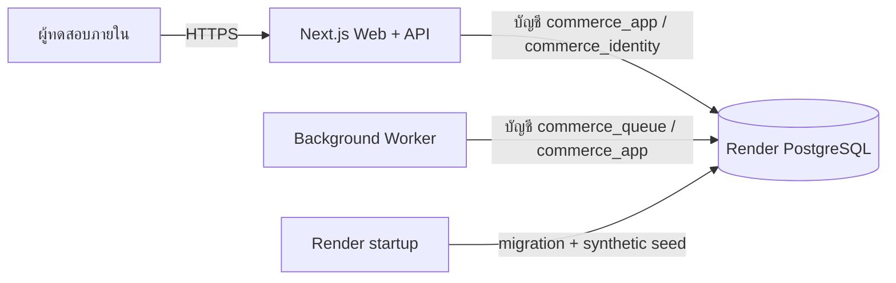

# Render staging readiness

วันที่ตรวจ: 16 กันยายน 2026

## เป้าหมาย

นำ product workflow ปัจจุบันขึ้นสภาพแวดล้อม staging สำหรับทดลองกับข้อมูลสมมติ โดยคงการแยก tenant, สิทธิ์ตามบทบาท, audit trail และฐานข้อมูลคนละชุดจาก production ตั้งแต่วันแรก

`render.yaml` สร้างทรัพยากรสามรายการใน Singapore:

- `commerce-ai-staging-web` ให้บริการ Next.js และตรวจสุขภาพผ่าน `/api/health`
- `commerce-ai-staging-worker` ประมวลผลงานคิวแยกจาก request ของผู้ใช้
- `commerce-ai-staging-db` ใช้ PostgreSQL 17 และปิดการเชื่อมต่อจากอินเทอร์เน็ต

เว็บและ worker ใช้บัญชีฐานข้อมูลแยกตามหน้าที่ รหัสผ่านสร้างโดย Render และใช้ร่วมกันผ่าน environment group บัญชีผู้ดูแลฐานข้อมูลมีอยู่เฉพาะช่วง migration/seed จากนั้น startup process จะลบค่าออกก่อนเปิด runtime process

## ขอบเขตของ staging นี้

- ใช้ข้อมูลสมมติและ `APP_MODE=staging-demo`
- ปิดการเรียกโมเดล AI ภายนอก (`AI_ENABLED=false`)
- ใช้ระบบ login ภายในสำหรับผู้ทดสอบที่ได้รับอนุญาต
- ไม่แสดงรหัสผ่านหรือรายชื่อบัญชีทดลองบนหน้าล็อกอิน
- cookie ใช้ `Secure`, ตรวจ Origin จาก hostname ของ Render และฐานข้อมูลใช้ RLS เดิม
- autodeploy ทำงานหลัง GitHub checks ผ่าน

สภาพแวดล้อมนี้ยังไม่รับข้อมูลลูกค้าจริงหรือข้อมูลส่วนบุคคล และยังไม่ใช่ production identity/SSO

## ขั้นตอนสร้าง staging

1. Merge branch ที่มี `render.yaml` เข้า `main` และยืนยันว่า GitHub checks ผ่าน
2. ใน Render เลือก **New > Blueprint** แล้วเชื่อม repository `kobdesign/commerce-ai`
3. ตรวจรายการและราคาของ web, worker และ PostgreSQL ก่อนยืนยันสร้างทรัพยากร
4. เมื่อ Render ถาม `STAGING_DEMO_PASSWORD` ให้กำหนดรหัสผ่านเฉพาะ staging อย่างน้อย 16 ตัวอักษร และห้ามใช้ `StudioDemo!2026`
5. รอให้ web และ worker deploy สำเร็จ แล้วเปิด `https://<render-hostname>/api/health` ซึ่งต้องตอบ `{"status":"ok"}`
6. เข้าเว็บด้วย `owner@chino.demo` และรหัสผ่าน staging ที่กำหนดในข้อ 4

Render จะรัน migration แบบ append-only ทุกครั้งก่อนเปิด process การรันซ้ำถูกล็อกด้วย PostgreSQL advisory lock และตรวจ checksum ของ migration ที่เคยใช้แล้ว ส่วน synthetic seed ใช้เฉพาะ staging web และตั้งรหัสผ่านผู้ทดสอบให้ตรงกับ secret ปัจจุบัน

## เกณฑ์ตรวจรับก่อนนำข้อมูลจริง

- health check ผ่านและไม่มี database error ใน logs
- web และ worker ใช้ internal database URL ใน region เดียวกัน
- ล็อกอิน, สลับบริษัท/ร้าน, เพิ่มสินค้า, import, review และ reversal ผ่าน smoke test
- ผู้ใช้ Tenant A มองไม่เห็นข้อมูล Tenant B
- ตรวจ backup/restore ด้วยแผนฐานข้อมูลที่เลือก และบันทึกผลการกู้คืน
- ยืนยันรูปแบบรายงาน TikTok จริงและสูตรเงินรับ/ต้นทุนกับผู้ดูแลการเงิน
- เปลี่ยน demo identity เป็น production identity provider พร้อม MFA/SSO ตามระดับลูกค้า
- เปิด AI ภายนอกหลังมี evaluation, budget, redaction และ monitoring แยก tenant

## Rollback

ถ้า release ใหม่ไม่ผ่าน health check Render จะไม่ย้าย traffic ไปยัง instance นั้น ถ้าพบปัญหาหลังเปิดใช้งาน ให้ rollback web และ worker ไป commit ก่อนหน้าเป็นคู่กัน ห้ามแก้ migration ที่ถูกใช้แล้ว ให้เพิ่ม migration ใหม่เพื่อย้อนผลอย่างตรวจสอบได้
